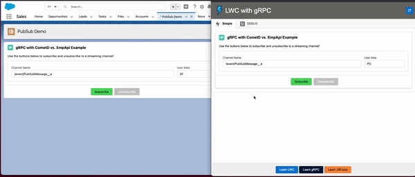

# Using LWC OSS With gRPC - Chat Demo App

- https://lwc.dev - Lightning Web Components 
- [Official gRPC Node JS Guide](https://www.grpc.io/docs/languages/node)

## This Project 
- This project include Subscription to the Streaming API in Salesforce in the form of a messanger chat.
- Connection to Salesforce Api via - [JSForce](https://jsforce.github.io/)
- It's quick demo for building apps **in** and **out** of Salesforce using Lightning Web Components (LWC) and gRPC Server to allow Streaming and Real-time server push updates. 

## 2 LWC apps talking to each other using Platform Events:   

## How to start?
- Clone this repository
- `git clone https://github.com/vyuvalv/lwc-grpc-pubsub.git`

## Salesforce App
- Go into the `salesforce_app` folder - [Salesforce App Instructions](salesforce_app/README.md)
- Deploy the code into your new scratch org from this folder. 
- You will have a Lightning App Page called `PubSub_Demo` or you can simply drag and drop the component `PubSub Chat Messenger` on any page layout.
- A Platform Event Object named `PubSubMessage__e` will need to be deployed.
- Issue a Personal Security Token or setup a Connected App on your org to allow login.
- Once you got it working on Salesforce - Copy the Credentials to the OSS app setup.

## LWC OSS App Using gRPC Server
- Go into the `oss_app` folder - [LWC OSS App Instructions](oss_app/README.md)
- Start with `npm install` - from the main `oss_app` directory.
    * Breakdown of the dependencies installed below :
    * run `npm i` - `npm install` 
        * `grpc` - main library for grpc
        * `@grpc/proto-loader` - handle protobuffers
        * `express-sse` - for server sent events push to client app
        * `jsforce` - Connection to Salesforce
        * `dotenv`- Storing parameters used for the connection to Salesforce Connected App option

- Setup your Org Credentials inside a new `.env` file on `oss_app` directory as mentioned inside the README file.
- Use the node scripts `npm run build` OR `npm run build:development` to build the `dist` folder for this app and to include SLDS inside your project. 
- Run `npm run watch` or `yarn watch` - to view the app.
- View on your port - by default `http://localhost:3001` for DEV and `http://localhost:5000` for production.

## Why gRPC ?
Follow here :
https://vyuvalv.medium.com/streaming-salesforce-platform-events-using-grpc-and-nodejs-6fa0206dca0